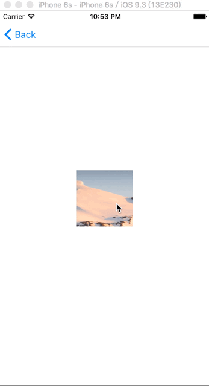

Core Animation

### CALayer的各种特殊图层。

CAShapeLayer

<!---->

CATextLayer

<!-- -->

CATransformLayer

<!---->

CAGradientLayer

<!---->

CAReplicatorLayer

<!---->

CAScrollLayer

<!---->

CATiledLayer

<!---->

CAEmitterLayer

<!---->

